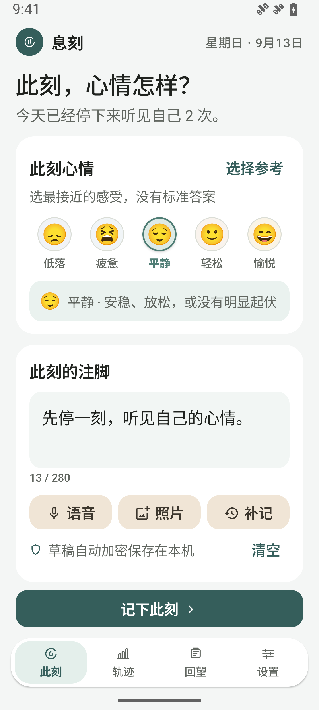
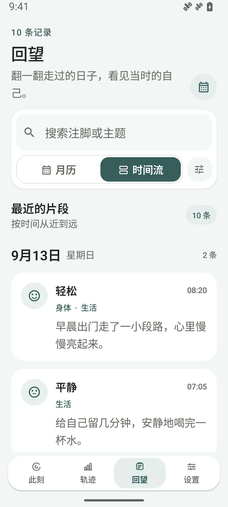
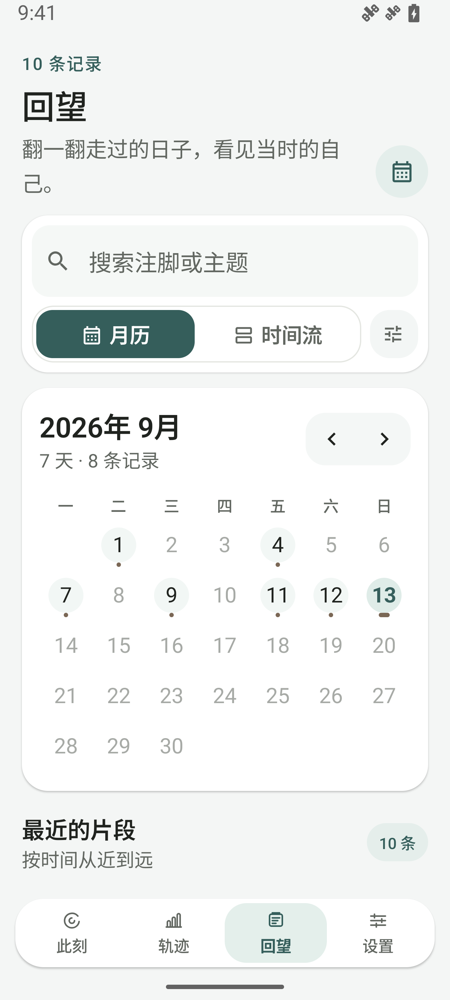
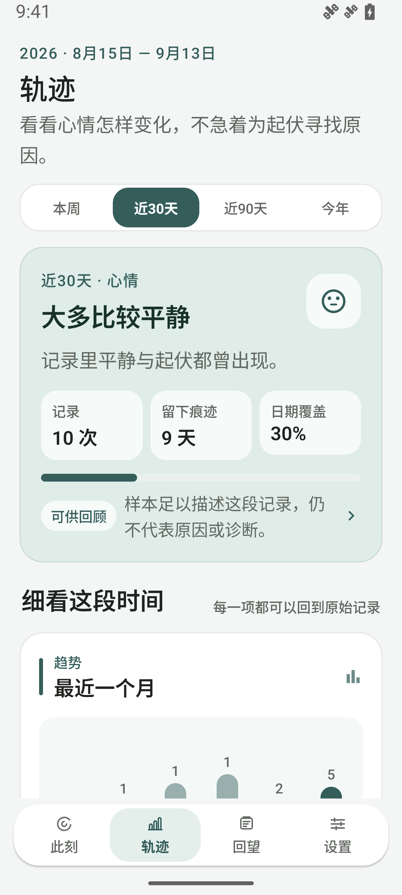
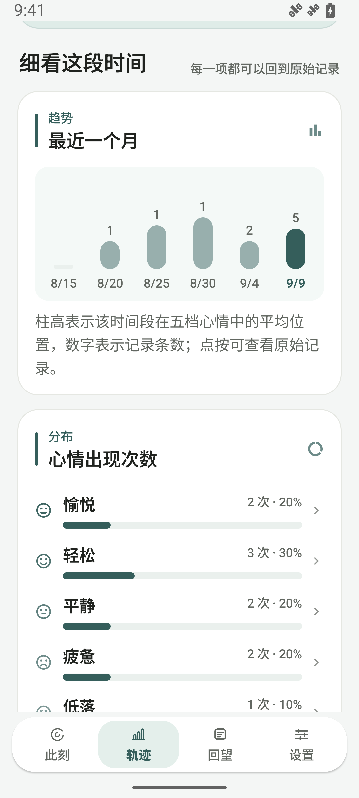
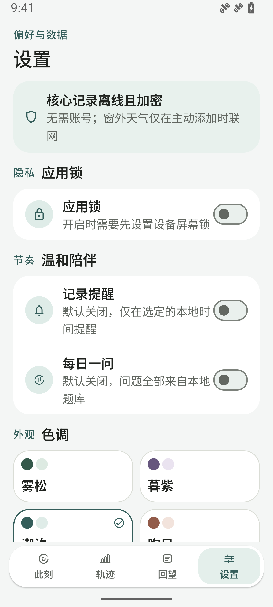

# 息刻

> 停一刻，听见自己。

息刻是一款离线优先的 Android 个人感受日记。选一种最接近当下的心情，就能记下一刻；文字、主题、照片、语音和窗外天气都可以按需添加。应用不需要账号，记录默认只留在本机。

## 应用预览

以下画面来自 1440 × 3200 的 Android 模拟器，记录内容为虚构演示数据。点击图片可查看原图。

| 记录此刻 | 回望（时间流） |
| :---: | :---: |
| <a href="docs/screenshots/moment.png"></a> | <a href="docs/screenshots/archive.png"></a> |

| 回望（月历） | 轨迹（近 30 天） |
| :---: | :---: |
| <a href="docs/screenshots/calendar.png"></a> | <a href="docs/screenshots/insights.png"></a> |

| 轨迹（趋势与分布） | 设置与隐私 |
| :---: | :---: |
| <a href="docs/screenshots/insights-detail.png"></a> | <a href="docs/screenshots/settings.png"></a> |

## 主要功能

- **轻量记录**：五种心情任选；可添加注脚、主题、最多 9 张照片，以及一段最长 5 分钟的语音。录音支持暂停、继续和试听，也可为过去的日期补记。未完成的内容会作为加密草稿留在本机。
- **回望与检索**：在月历和时间流之间切换；按注脚与主题搜索，并组合心情、主题、日期和照片筛选。已保存的记录可以编辑；删除需要确认，并在提示消失前支持撤销。
- **温和的轨迹**：查看心情分布、记录覆盖度、前一周期对比、主题变化和工作日／周末对照。统计会显示样本范围与限制，可回到对应原始记录。本地回望文字在设备内生成。
- **自主节奏**：可按星期和时间设置提醒、夜间勿扰或暂停一周，也可启用本地“每日一问”。两者默认关闭；长按桌面图标可直接“记录此刻”。

## 运行

使用 Android Studio 打开本目录，准备 Android SDK Platform 36、Build Tools 36.1.0 和 JDK 17（Android Studio 自带的 JBR 也可以）。最低支持 Android 8.0（API 26）。

在 macOS／Linux 上构建并安装到已连接的设备或模拟器：

```bash
./gradlew :app:assembleDebug
./gradlew :app:installDebug
```

Windows 使用 `gradlew.bat` 执行相同任务；也可以在 Android Studio 中运行 `app` 配置。调试 APK 位于 `app/build/outputs/apk/debug/app-debug.apk`。

## 数据与隐私

日记、主题和搜索索引保存在 Room／SQLCipher 加密数据库中，随机数据库口令由 Android Keystore 中不可导出的密钥封装。照片和语音附件分别加密，存放在应用私有目录。可用系统面容、指纹或设备密码开启应用锁，并选择离开应用后的锁定时间。

只有主动添加“此刻窗外”时才会联网查询 Open-Meteo 天气；选择定位时仅使用一次前台粗略位置，也可以拒绝定位并手动输入城市。经纬度不会写入草稿、日记或备份。保存的城市级地点与天气快照会和日记一起加密；补记过去时不会自动附加今天的天气。

备份通过系统文件选择器导出到用户选定的位置，并在导出前用用户密码进行 AES-GCM 加密，包含全部记录、照片和语音。只有用户主动分享内容时，本地回望文字才会离开息刻。

## 更多文档

- [产品 Roadmap](docs/roadmap.md)：后续功能规划。
- [仓库说明](docs/repository-overview.md)：技术栈、架构、数据安全边界与目录。
- [应用锁设计](docs/app-lock-design.md)：身份验证与自动锁定取舍。
- [GitHub Release 流水线](docs/github-release-pipeline.md)：发布签名与自动构建。

推送 `vMAJOR.MINOR.PATCH` 标签后，GitHub Actions 会执行测试、Lint、签名构建，并把 APK、AAB 和 SHA-256 校验文件发布到 GitHub Release；首次发布需要先配置签名。
