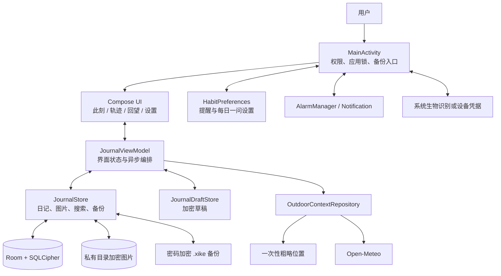

# 息刻（Xike）仓库说明

> 文档依据：仓库在 2026-08-27 的代码与配置状态。

## 1. 项目概述

息刻是一款面向 Android 的离线优先个人感受日记应用，产品标语是“停一刻，听见自己”。它希望让用户在十几秒内记录当下，并在之后安全、可靠地找回和理解这些记录。

应用不要求账号，也没有自建服务端。日记正文、关键词、搜索索引和图片附件默认保存在设备本地并加密；仅当用户主动添加“窗外此刻”时，应用才会请求一次粗略位置并调用 Open-Meteo 获取当前天气。提醒、每日一问和分析均在设备本地完成。

当前仓库是一个单模块 Android 工程，应用包名为 `com.xike.app`，最低支持 Android 8.0（API 26），目标版本为 API 36。

## 2. 一句话定位

**一个无账号、弱联网、重视数据所有权和隐私边界的 Android 情绪日记。**

它不把重点放在社交、云同步或 AI 解读上，而是优先建设快速记录、本地检索、可信洞察、加密存储和可迁移备份。

## 3. 核心能力

### 记录此刻

- 5 档心情：低落、疲惫、平静、轻松、愉悦。
- 16 个预设关键词，覆盖工作、关系、身体、睡眠、兴趣等场景。
- 最多 280 字注脚。
- 每条记录最多添加 9 张图片，单张上限 20 MB。
- 支持系统相机拍摄和系统照片选择器。
- 支持补记过去的日期与时间。
- 未完成内容会保存为加密草稿，进程重建后可继续编辑。
- 用户可主动添加城市级地点、当前温度和天气状况。

### 回望与查找

- 月历和时间流两种浏览方式。
- 基于 Room FTS4 的本地全文搜索。
- 可组合筛选心情、关键词、日期范围和是否包含图片。
- 支持查看、编辑和删除已有记录。
- 删除需要确认，并提供一次短时撤销。

### 轨迹与洞察

- 支持本周、近 30 天、近 90 天和今年等时间范围。
- 展示心情分布、记录覆盖度、前一周期对比和关键词趋势。
- 提供工作日与周末对照。
- 每项分析都保留样本范围说明，并可下钻到原始记录。
- 回顾文字在本机生成；只有用户主动分享时才交给其他应用。

### 隐私与数据所有权

- SQLCipher 加密整个 Room 数据库。
- Android Keystore 中的不可导出 AES 密钥用于封装随机数据库口令。
- 图片附件独立加密后保存在应用私有目录。
- 草稿保存在 `EncryptedSharedPreferences` 中。
- 应用锁使用系统面容、指纹或设备凭据，不自建 PIN 体系。
- 支持由用户密码保护的加密备份、恢复前校验和恢复后一次撤销。
- 禁止 Android 系统自动备份应用数据。

### 温和习惯支持

- 可按时间和星期配置本地提醒。
- 支持夜间勿扰和暂停一周。
- 支持桌面“记录此刻”快捷入口。
- 提供 3 套完全本地的每日一问题库。
- 所有提醒和问题功能默认关闭，不使用连续打卡惩罚。

## 4. 技术栈

| 类别 | 选型 |
| --- | --- |
| 语言 | Kotlin 2.3.21 |
| 构建系统 | Gradle Kotlin DSL、Android Gradle Plugin 8.13.2 |
| Java 工具链 | JDK 17 |
| UI | Jetpack Compose、Material 3 |
| 状态与异步 | Android ViewModel、Compose State、Kotlin Coroutines、Flow |
| 数据库 | Room 2.8.4、FTS4、SQLCipher 4.17.0 |
| 本地加密 | Android Keystore、AndroidX Security Crypto、AES-GCM |
| 身份验证 | AndroidX Biometric |
| 外部天气 | Open-Meteo Forecast 与 Geocoding API |
| 测试 | JUnit 4、Room Testing、AndroidX Test、Compose UI Test |
| 持续集成 | GitHub Actions |

版本配置以 [`app/build.gradle.kts`](../app/build.gradle.kts) 为准。CI 发布时通过 `XIKE_VERSION_NAME` 和 `XIKE_VERSION_CODE` 注入版本；未注入时本地构建默认使用 `0.1.0` 和 `1`。

## 5. 架构概览

工程采用单 Activity、Compose UI 和 ViewModel 驱动的结构。它接近轻量 MVVM，但没有拆分成多个 Gradle 功能模块；业务、存储和界面主要按 Kotlin 文件划分。



典型的保存链路如下：

1. 用户在 `MomentScreen` 中选择心情、关键词、注脚和图片。
2. `JournalViewModel` 持有当前草稿状态，并将草稿同步到加密偏好设置。
3. 保存时，`JournalStore` 先导入并加密图片，再通过事务写入日记、关键词、图片引用和全文搜索文档。
4. Room 的 `Flow` 推送最新记录列表，Compose 界面自动刷新。

## 6. 主要代码模块

| 文件 | 职责 |
| --- | --- |
| [`MainActivity.kt`](../app/src/main/java/com/xike/app/MainActivity.kt) | 应用入口；处理系统权限、生物识别、应用生命周期、备份文件选择、底部导航和全局对话框。 |
| [`JournalViewModel.kt`](../app/src/main/java/com/xike/app/JournalViewModel.kt) | 连接 UI 与数据层；编排初始化、草稿、增删改查、天气、备份和恢复。 |
| [`JournalStore.kt`](../app/src/main/java/com/xike/app/JournalStore.kt) | 日记仓储；负责数据库访问、附件加密、删除撤销、旧数据迁移、备份与恢复。 |
| [`JournalDatabase.kt`](../app/src/main/java/com/xike/app/JournalDatabase.kt) | Room 实体、DAO、事务、FTS4 搜索表、SQLCipher 初始化和数据库迁移。 |
| [`JournalDraft.kt`](../app/src/main/java/com/xike/app/JournalDraft.kt) | 草稿模型、规范化、JSON 序列化和加密持久化。 |
| [`JournalSearch.kt`](../app/src/main/java/com/xike/app/JournalSearch.kt) | 搜索条件、分页结果、内存筛选工具和月历日期计算。 |
| [`JournalAnalytics.kt`](../app/src/main/java/com/xike/app/JournalAnalytics.kt) | 纯 Kotlin 的周期统计、心情分布、覆盖度、关键词与工作日/周末分析。 |
| [`XikeUi.kt`](../app/src/main/java/com/xike/app/XikeUi.kt) | 主题、导航、记录页、设置页和通用 Compose 组件。 |
| [`JournalArchiveUi.kt`](../app/src/main/java/com/xike/app/JournalArchiveUi.kt) | 回望、搜索、筛选、详情、编辑、删除和图片浏览界面。 |
| [`JournalInsightsUi.kt`](../app/src/main/java/com/xike/app/JournalInsightsUi.kt) | 轨迹、图表、样本说明和原始记录下钻界面。 |
| [`OutdoorContext.kt`](../app/src/main/java/com/xike/app/OutdoorContext.kt) | 一次性粗略定位、城市检索、天气请求和天气快照规范化。 |
| [`PhotoCapture.kt`](../app/src/main/java/com/xike/app/PhotoCapture.kt) | 系统相机拍摄、相册写入、未完成拍摄清理和照片来源 UI。 |
| [`ReminderScheduler.kt`](../app/src/main/java/com/xike/app/ReminderScheduler.kt) | 本地闹钟、通知、开机/时区变化后的提醒重排。 |
| [`HabitPreferences.kt`](../app/src/main/java/com/xike/app/HabitPreferences.kt) | 提醒、勿扰、暂停和每日一问设置。 |
| [`AppLockPreferences.kt`](../app/src/main/java/com/xike/app/AppLockPreferences.kt) | 应用锁开关和自动锁定时间设置。 |
| [`DatabaseKeyManager.kt`](../app/src/main/java/com/xike/app/DatabaseKeyManager.kt) | 创建随机 SQLCipher 口令，并使用 Android Keystore AES-256-GCM 密钥封装。 |

## 7. 数据模型与持久化

当前 Room schema 版本为 3，包含以下表：

| 表 | 用途 |
| --- | --- |
| `journal_entries` | 日记主记录，包括时间、心情、注脚和可选天气快照。 |
| `journal_tags` | 按顺序保存每条日记的关键词。 |
| `journal_images` | 按顺序保存每条日记引用的加密图片文件名。 |
| `journal_entries_fts` | FTS4 全文搜索文档，索引注脚和关键词。 |
| `app_settings` | 主题、旧数据迁移标记和搜索索引版本等应用设置。 |

`journal_tags` 和 `journal_images` 通过外键关联日记，删除主记录时级联删除引用。新增、更新、删除、批量替换和搜索索引重建均由 DAO 事务封装。

图片文件不直接存入数据库。数据库只保存随机文件名，实际内容使用 `EncryptedFile` 独立加密后写入应用私有目录。启动后会异步清理没有被日记或待撤销删除引用的孤儿图片。

## 8. 安全与网络边界

### 数据库密钥

首次创建数据库时，应用生成 32 字节随机 SQLCipher 口令。口令由 Android Keystore 中不可导出的 AES-256-GCM 密钥封装后再保存；如果数据库存在但封装口令丢失，应用会停止打开数据库，以避免用新密钥覆盖原数据。

### 备份格式

当前备份使用流式格式：清单和图片先写入 ZIP 流，再使用由用户密码派生的 AES-256-GCM 密钥加密。密钥派生使用 PBKDF2-HMAC-SHA256、随机盐和 210,000 次迭代。恢复过程会限制日记数量、图片数量、单图大小、总图片大小和文件名，先在临时目录完整校验，再替换设备内容。

恢复前会生成设备内加密撤销快照；成功恢复后可以撤销一次。代码同时保留对旧版备份格式的兼容读取。

### 联网范围

应用拥有 `INTERNET` 权限，但常规记录、搜索、洞察、提醒、加密和备份均不依赖网络。当前唯一明确的应用内网络调用是用户主动触发的 Open-Meteo 天气与城市查询：

- 只请求一次前台粗略位置，不进行后台定位。
- 请求前将经纬度四舍五入到 3 位小数。
- 经纬度不写入草稿、数据库或备份。
- 日记只保存城市级地点名称和当时的天气快照。

## 9. 目录结构

```text
Xike/
├── app/
│   ├── build.gradle.kts              # Android 应用模块配置
│   ├── schemas/                      # 导出的 Room schema 1–3
│   └── src/
│       ├── main/                     # 应用代码、Manifest 与资源
│       ├── test/                     # JVM 单元测试
│       └── androidTest/              # 数据库、迁移与 Compose 仪器测试
├── docs/
│   ├── repository-overview.md        # 本文档
│   ├── roadmap.md                    # 产品路线图
│   ├── local-development.md          # 本地开发环境
│   ├── app-lock-design.md            # 应用锁设计
│   ├── release-checklist.md          # 发布前检查清单
│   └── github-release-pipeline.md    # 发布流水线说明
├── scripts/check-jdk17.sh            # JDK 17 环境自检
├── .github/workflows/ci.yml          # PR 验证
├── .github/workflows/release.yml     # 标签触发发布
├── build.gradle.kts                  # 根构建插件版本
├── settings.gradle.kts               # 仓库与模块声明
└── README.md                         # 面向使用者的项目首页
```

## 10. 本地开发

### 环境要求

- JDK 17。
- Android SDK Platform 36。
- Android SDK Build Tools 36.1.0。
- Android Studio，或可执行 Android Gradle 任务的命令行环境。

macOS 或 Linux 可先运行：

```bash
./scripts/check-jdk17.sh
```

执行与 PR CI 一致的主要验证：

```bash
./gradlew testDebugUnitTest lintDebug assembleDebug assembleDebugAndroidTest
```

连接 API 26 以上的真机或模拟器后运行设备测试：

```bash
./gradlew connectedDebugAndroidTest
```

更详细的环境说明见 [`docs/local-development.md`](local-development.md)。

## 11. 测试与质量保障

仓库同时包含 JVM 单元测试和 Android 仪器测试。

### JVM 测试重点

- 洞察统计、时区和日期边界。
- 搜索与筛选逻辑。
- 草稿规范化。
- 提醒和每日一问设置。
- 应用锁超时判断。
- 天气快照与时间编辑规则。

### Android 仪器测试重点

- Room DAO 和数据库 schema 迁移。
- 旧版存储迁移。
- 含图片的加密备份与恢复。
- 删除和恢复撤销。
- 草稿持久化与 Compose UI。
- 回望和轨迹用户界面。
- 相机拍摄相关生命周期。

PR 工作流运行单元测试、Lint、Debug APK 构建和 Android 测试 APK 构建。真机测试不在常规 GitHub Actions PR 工作流中自动执行，因此发布前仍需按检查清单进行设备烟测。

## 12. 发布流程

发布由符合 `vMAJOR.MINOR.PATCH` 格式的 Git 标签触发，主要阶段是：

1. 校验标签并计算 Android `versionName` 与 `versionCode`。
2. 运行测试和 Android Lint。
3. 从 GitHub Secrets 临时恢复发布密钥。
4. 构建并验证签名 APK 和 AAB。
5. 生成 `SHA256SUMS.txt` 与构建信息。
6. 创建或更新 GitHub Release。

签名构建任务只有仓库只读权限；具备 `contents: write` 权限的发布任务不会接收签名密钥。完整说明见 [`docs/github-release-pipeline.md`](github-release-pipeline.md)。

## 13. 当前工程状态与演进方向

根据 [`docs/roadmap.md`](roadmap.md)，项目当前仍处于 1.0 前的快速迭代阶段。记录、回望、检索、洞察、加密、应用锁、提醒和发布主链路已经具备，后续重点包括：

- 自定义关键词。
- 更安全、可预览、可合并的备份恢复体验。
- 用户授权目录中的定期加密备份。
- Markdown/CSV 明文导出及清晰的隐私警告。
- API 26–36 真机矩阵、动态字体、TalkBack、大屏和低存储验证。
- 启动、搜索、图片解码和大备份的性能基线。

从代码结构看，`XikeUi.kt`、`JournalArchiveUi.kt`、`JournalInsightsUi.kt` 和 `MainActivity.kt` 体积较大。随着功能继续增长，按功能拆分 UI、状态和数据访问边界会是重要的可维护性工作。

## 14. 新维护者建议阅读顺序

1. 先读根目录 [`README.md`](../README.md)，理解产品定位和用户能力。
2. 阅读本文档，建立代码、数据和发布的整体认识。
3. 从 [`MainActivity.kt`](../app/src/main/java/com/xike/app/MainActivity.kt) 和 [`JournalViewModel.kt`](../app/src/main/java/com/xike/app/JournalViewModel.kt) 跟踪主流程。
4. 阅读 [`JournalStore.kt`](../app/src/main/java/com/xike/app/JournalStore.kt) 与 [`JournalDatabase.kt`](../app/src/main/java/com/xike/app/JournalDatabase.kt)，理解数据安全边界。
5. 根据任务进入记录、回望、轨迹、天气或提醒的具体文件。
6. 修改 schema、备份或图片链路前，先查看相关迁移测试和 [`docs/release-checklist.md`](release-checklist.md)。

息刻的核心约束可以概括为：**先保证用户的数据安全、可找回、可迁移，再增加新的表达和洞察能力。**
